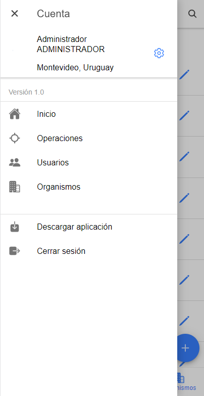
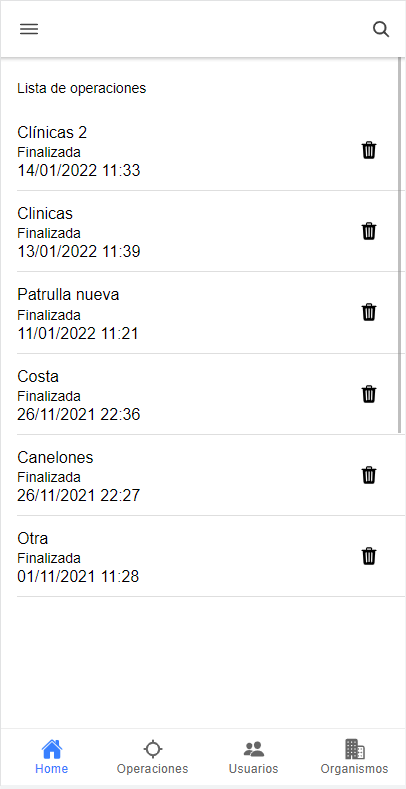
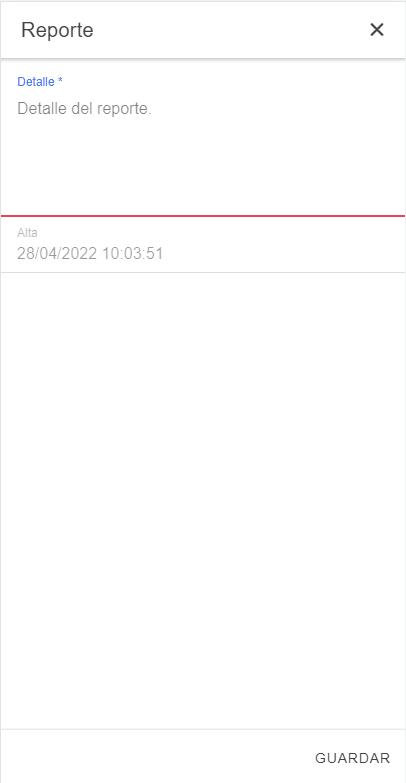
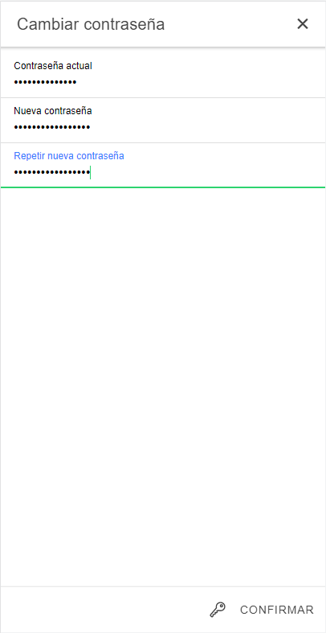
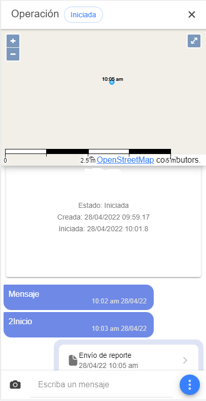
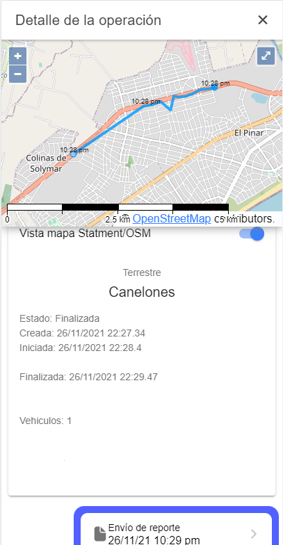
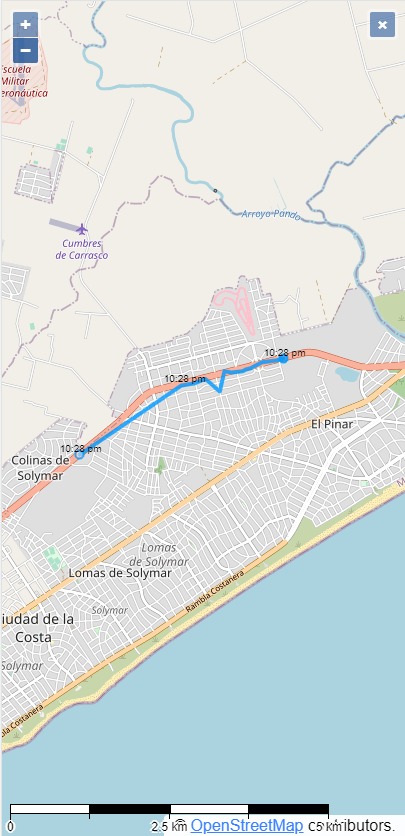
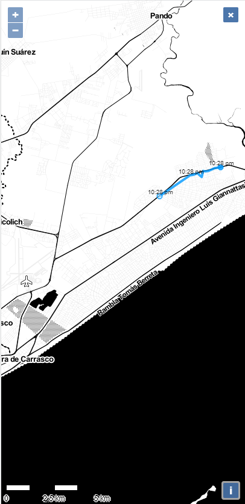

# GeoApp 

GeoApp is an application to report the location in real time in a hierarchical way. It is able to keep track of the location and notify or report events.

This project is built with Ionic, Node and Mongo technology. The deployment of the application is done with Docker Compose.

It uses OpenStreetMaps as a base layer and on top of this OpenLayers is used to draw features to trace routes and show directions.

I am grateful to the creaator of the project node-express-mongodb-jwt-rest-api-skeleton that I take as a base to carry out the backend in Node

I hope it can help as an example for what you are developing, feel free to use what you need for your own project.

## Resume requieriments

- Allow to work in the application without coverage.
- Possibility of synchronizing any information when there is coverage.
- The system defines 3 roles that correspond to: patrol, operations and general.
- Operations can report incidents and observations
- Patrol will be able to see its own information, the operations of all its patrols and the general all the information.
- Being able to send images by messaging or attached to the report.

### Fonts
[node-express-mongodb-jwt-rest-api-skeleton](https://github.com/davellanedam/node-express-mongodb-jwt-rest-api-skeleton/blob/master/README.md)
[OpenLayers (npm)](https://www.npmjs.com/package/ol)
[How to use OpenLayers in Angular](https://stackoverflow.com/questions/48283679/use-openlayers-4-with-angular-5)
[Angular OpenLayers Example](https://github.com/pzaenger/angular-openlayers)
[Ionic Storage](https://github.com/ionic-team/ionic-storage)
[Ionic Install Capacitor](https://capacitor.ionicframework.com/docs/getting-started/)
[Ionic plugin Geolocation](https://capacitor.ionicframework.com/docs/getting-started/)


### Getting started

1. Browse to the Ionic app root directory

```bash
cd apache/app
```

2. Install node modules with npm

```bash
npm install
```

3. Build ionic app for production

```bash
ionic build --prod --build-optimizer=false
```

4. For node do the same, go to root app directory

```bash
cd node/app-server
```

5. Install node modules with npm

```bash
npm install
```

### Deploy with Docker Compose

1. Go to root docker directory (docker-compose.yml)

2. Build containers

```bash
docker-compose build
```

4. Run containers

```bash
docker-compose up -d
```

5. If you want see the legs (optional)

```bash
docker-compose logs -ft
```

6. To stop containers (optional)

```bash
docker-compose down
```

7. To access into a container (optional), for example mongo

```bash
docker exec -ti mongo-container /bin/bash
```

### Funcionalities

  - Login
  - Start
  - Search control
  - Menu entries
  - User profile
  - Change Password
  - Active operations
  - Operation form
  - Start an active trade
  - Report form
  - Detail of the operation
  - OSM map display
  - Deployment of the declarative map
  - User profiles
  - Users Management
  - User form
  - Organisms
  - Organization form


#### Menu



#### List operations



#### Report Form



#### Pass Form



#### Active Operation



#### Detail Operation



#### Map OSM



#### Basic Map OSM


